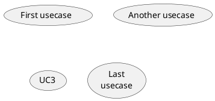

#TODOs
- [ ] Define domain
    - [ ] Find a tool to write domain as  test and convert it into UML diagram
    - [ ] add watching to file in order to generate continuously the UML diagram as writing
<<<<<<< Updated upstream





@startuml;

actor User;
participant "First Class" as A;
participant "Second Class" as B;
participant "Last Class" as C;

User -> A: DoWork;
activate A;

A -> B: Create Request;
activate B;

B -> C: DoWork;
activate C;

C --> B: WorkDone;
destroy C;

B --> A: Request Created;
deactivate B;

A --> User: Done;
deactivate A;

@enduml
'>
     
=======
    
    
    
    ```mermaid
    graph TD;
        A-->B;
        A-->C;
        B-->D;
        C-->D;
    ```
    
    
    
![Alt text](https://g.gravizo.com/svg?digraph%20G%20{aize%20=%224,4%22;main%20[shape=box];main%20-%3E%20parse%20[weight=8];parse%20-%3E%20execute;main%20-%3E%20init%20[style=dotted];main%20-%3E%20cleanup;execute%20-%3E%20{%20make_string;%20printf}init%20-%3E%20make_string;edge%20[color=red];main%20-%3E%20printf%20[style=bold,label=%22100%20times%22];make_string%20[label=%22make%20a%20string%22];node%20[shape=box,style=filled,color=%22.7%20.3%201.0%22];execute%20-%3E%20compare;}
>>>>>>> Stashed changes
