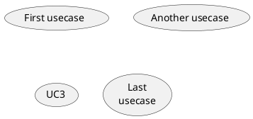

#TODOs
- [ ] Define domain
    - [ ] Find a tool to write domain as  test and convert it into UML diagram
    - [ ] add watching to file in order to generate continuously the UML diagram as writing

